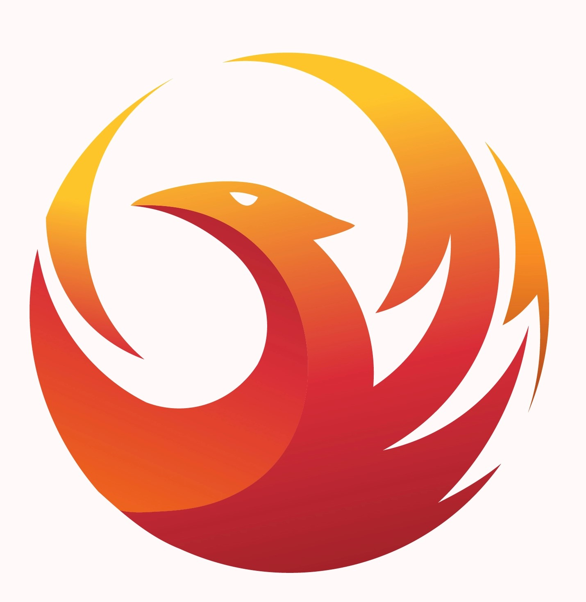

  
   

  <h1><b>Your API-based webapp</b></h1>
  <h2><b>JavaScript capstone project</b></h2>

<!-- TABLE OF CONTENTS -->

# 📗 Table of Contents

- [📖 About the Project](#about-project)
  - [🛠 Built With](#built-with)
    - [Tech Stack](#tech-stack)
    - [Key Features](#key-features)
  - [🚀 Live Demo](#live-demo)
- [💻 Getting Started](#getting-started)
  - [Setup](#setup)
  - [Prerequisites](#prerequisites)
  - [Install](#install)
  - [Usage](#usage)
  - [Run tests](#run-tests)
  - [Deployment](#deployment)
- [👥 Authors](#authors)
- [🔭 Future Features](#future-features)
- [🤝 Contributing](#contributing)
- [⭐️ Show your support](#support)
- [🙏 Acknowledgements](#acknowledgements)
- [❓ FAQ (OPTIONAL)](#faq)
- [📝 License](#license)

<!-- PROJECT DESCRIPTION -->

# 📖 Capstone project 

This project is the final project for the module 2, it was created for test habilities html, scss, js, js modules and test with jest. 

# 🎞 Video presentation 

You can see a little presentation of our project in this link

https://drive.google.com/file/d/1cbIEmgWiqHJEKHZBd6h1UdkO_v6LEBji/view?usp=sharing

## 🛠 Built With 

### Tech Stack 

  
Html files

  <ul>
    <li>This file is the template to recieve the dinamical js content</li>
  </ul>

Scss file

  <ul>
    <li>this files help us to give the visual part to the html file content</li>
  </ul>

Js files

  <ul>
    <li>this file help us to use DOM into the html files and do funtions features</li>
  </ul>

  
Liters

  <ul>
    <li>the liters to help find error in the code </li>
  </ul>

  
Webpack

  <ul>
    <li>We use web pack in this project </li>
  </ul>

  
Jest

  <ul>
    <li>This project use jest to test.</li>
  </ul>

### Key Features 

- **[The liters that I use is it html, css and js]**
- **[The html file was code it in html5]**

(<a href="#readme-top">back to top</a>)

## 💻 Getting Started 

This project HTML/CSS & JavaScript is a project created for practice the js modules, js codding, the use of webpack and the use of gitflow. 

### Prerequisites

In order to run this project you need:

- Have a last version of your browser

### Setup

Clone this repository to your desired folder:

- git clone https://github.com/lRebornsl/api-capstone.git

### Install

Install this project with:

you do not need install anything

### Usage

To run the project, execute the following command:

- npm init
- npm run start

### Run tests

To run tests, run the following command:

- npm run test 

### Deployment

You can check the project deploy in this link 

https://lrebornsl.github.io/api-capstone/dist/ 

(<a href="#readme-top">back to top</a>)

## 👥 Authors 

Andres Zamorano Medina

👤 **Andy Zam**

- GitHub: [Andres Zamorano](https://github.com/Dachrono)
- Twitter: [Andres Zamorano](https://twitter.com/Dachrono)
- LinkedIn: [Andres Zamorano](https://www.linkedin.com/in/andres-zamorano-785b77a1/)

👤 **lRebornsl**

- GitHub: [@lRebornsl](https://github.com/lRebornsl)
- Twitter: [@RebornsDev](https://twitter.com/RebornsDev)
- LinkedIn: [Anthony Vásquez](https://www.linkedin.com/in/avvm98/)

(<a href="#readme-top">back to top</a>)

## 🔭 Future Features 

**[We will create location page]** 
**[We will create items page]** 
**[We will publish more pokemons]**

(<a href="#readme-top">back to top</a>)

## 🤠Contributing 

Contributions, issues, and feature requests are welcome!

Feel free to check the [issues page](https://github.com/lRebornsl/api-capstone/issues).

(<a href="#readme-top">back to top</a>)

<!-- SUPPORT -->

## ⭐️ Show your support 

If you like this project please feel fre to send me corrections for make it better I would feel glad to read your comments  

(<a href="#readme-top">back to top</a>)

<!-- ACKNOWLEDGEMENTS -->

## 🙠Acknowledgments 

(<a href="#readme-top">back to top</a>)

<!-- FAQ (optional) -->

## ❓ FAQ (OPTIONAL) 

- **[Can I use with a templeate your project?]**

  - [Of course I would feel honored]

- **[Your project is free license?]**

  - [Yeah, you can use it completly]

(<a href="#readme-top">back to top</a>)

<!-- LICENSE -->

## 📠License 

this project is [MIT](./LICENSE) licensed.

(<a href="#readme-top">back to top</a>)
